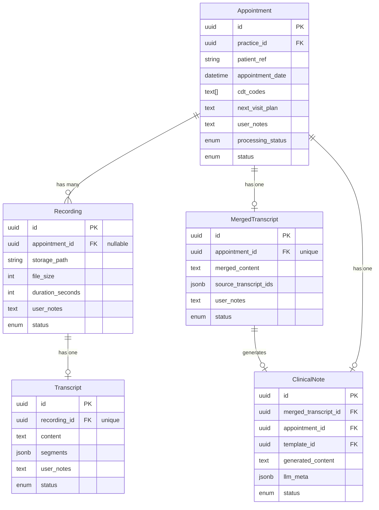
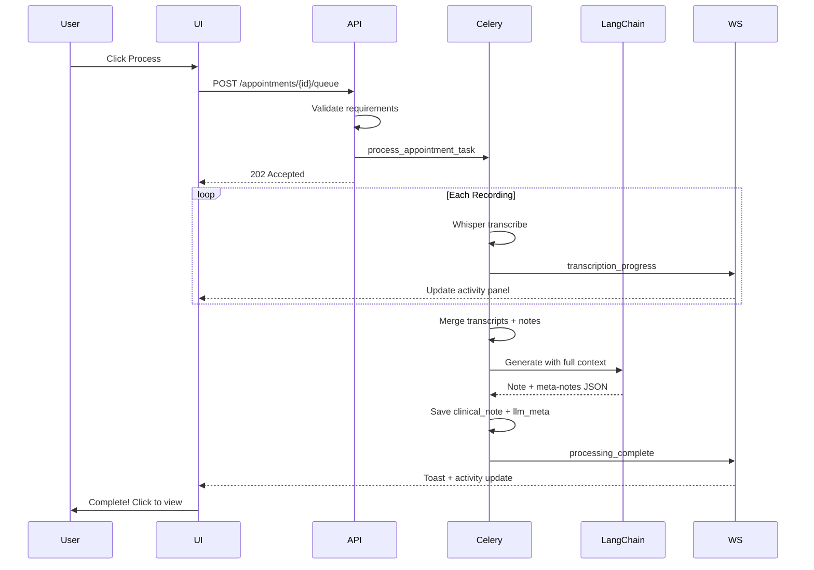

# NoteSmith Core Workflow

## Data Model



**Design Principles:**

- Constructive only: raw transcripts never modified
- Reconstructible: can re-process from any step
- User notes on all entities visible to LLM

---

## Phase 1: Database Migration

**File:** `supabase/migrations/004_workflow_enhancements.sql`

| Change | Details |

|--------|---------|

| `appointments` | Add `processing_status` enum, `cdt_codes TEXT[]`, `next_visit_plan TEXT` |

| `recordings` | Make `appointment_id` nullable, add `user_notes TEXT` |

| `transcripts` | Add `user_notes TEXT` |

| New: `merged_transcripts` | `id`, `appointment_id` (unique), `merged_content`, `source_transcript_ids`, `user_notes`, `status` |

| `clinical_notes` | Add `merged_transcript_id`, `appointment_id`, `llm_meta JSONB`; drop `transcript_id` |

| New: `activity_events` | `id`, `user_id`, `event_type`, `resource_type`, `resource_id`, `message`, `data`, `read`, `created_at` |

---

## Phase 2: LLM Integration (LangChain)

**Migrate to LangChain** for provider abstraction and structured prompts.

### Files

- `backend/app/services/llm/langchain_provider.py` - LangChain wrapper
- `backend/app/services/llm/prompts.py` - Prompt templates
- `backend/app/services/template_engine.py` - Delimiter normalization

### Template Processing

- Support both `< field >` and `{{ field }}` syntax
- Convert angle brackets to Jinja2 internally: `< field >` becomes `{{ field }}`

### LLM Prompt Structure

```
INSTRUCTIONS:
You are an expert dental administrative assistant. Your task is to take unstructured dental appointment data, analyze and format it into an legally-sound clinical note.
1. Analyze all data in the <APPOINTMENT DATA> block.
2. Format the data EXACTLY according to the provided template. Fill ONLY {{ field }} placeholders
3. RIGIDLY maintain template structure
4. Field names hint at expected content; fields may contain additional formatting instructions
5. Identify any useful information, reminders, action items, etc. and compose analysis meta-notes

OUTPUT:
A JSON object containing:
1. Completed and formatted clinical note (text)
2. JSON meta-notes block (text)

<EXAMPLE OUTPUT>
{
    "formatted_note": formatted clinical note,
    "meta": analysis meta-notes
}

<APPOINTMENT DATA>
- Transcript: {merged_content}
- CDT Codes: {cdt_codes}
- Next Visit: {next_visit_plan}
- User Notes: {all_notes}

<TEMPLATE>
TEMPLATE:
{normalized_template}

```

2nd stage (structured format enforcement, run as error-correction if bad output received from 1st stage)

```
Reformat the following data to match the example:

<EXAMPLE>
{
    "formatted_note": formatted clinical note,
    "meta": analysis meta-notes
}

<DATA>
{result from failed 1st stage}
```

### LLM Meta-Notes

Stored in `clinical_notes.llm_meta` (JSONB), displayed separately in UI:

- `action_items[]` - Suggested follow-ups
- `questions[]` - Clarifications for user
- `particularities[]` - Notable observations

---

## Phase 3: Backend API

### 3.1 Appointments API

| Endpoint | Purpose |

|----------|---------|

| `POST /` | Create with cdt_codes, next_visit_plan, user_notes |

| `GET /` | List with status filters |

| `GET /{id}` | Get with recordings count |

| `PATCH /{id}` | Update any field |

| `POST /{id}/queue` | Validate and queue for processing |

| `GET /{id}/outputs` | Get merged transcript + note + exports |

### 3.2 Recordings API

| Endpoint | Purpose |

|----------|---------|

| `POST /upload` | Upload orphan recording |

| `POST /upload/{appointment_id}` | Upload attached to appointment |

| `GET /` | List all with filters |

| `GET /{id}` | Get details + transcript status |

| `PATCH /{id}` | Update user_notes |

| `PATCH /{id}/attach` | Attach to appointment |

| `GET /{id}/download` | Signed download URL |

### 3.3 WebSocket + Activity

- `WS /ws/activity` - Real-time notifications
- Redis pub/sub for Celery-to-WebSocket communication
- Events: `transcription_progress`, `processing_complete`, `error`

### 3.4 Processing Pipeline

`process_appointment_task(appointment_id)`:

1. **Validate**: >= 1 recording, template selected
2. **Transcribe**: Whisper each recording, emit progress
3. **Merge**: Concatenate transcripts with metadata
4. **Generate**: LangChain prompt with full context
5. **Complete**: Parse meta-notes, emit notification

---

## Phase 4: Frontend Modules

### 4.1 Appointments

| Page | Features |

|------|----------|

| List | Status badges, recording count, "Process" button |

| Create | Date (default: now), patient_ref, CDT codes input, next visit plan, notes |

| View | Details, recordings list, upload zone, outputs, process button |

| Edit | All fields editable |

### 4.2 Recordings

| Page | Features |

|------|----------|

| List | All recordings, appointment links, upload button |

| View | File info, transcript preview, download, attach modal, copy transcript |

### 4.3 Notes

| Page | Features |

|------|----------|

| List | Completed notes with appointment links |

| View | Generated note, LLM meta-notes panel, export buttons |

### 4.4 Activity Panel

- Slide-out panel in dashboard layout
- Real-time WebSocket updates
- Interactive items: "Complete! [View Note]"
- Toast notifications (top-right)

---

## Processing Flow



---

## Implementation Order

1. Database migration
2. Backend models (all entities)
3. LangChain integration
4. Recordings API (full CRUD + orphan support)
5. Appointments API (full CRUD + queue + outputs)
6. WebSocket + activity service
7. Processing pipeline task
8. Frontend API client
9. Frontend Recordings module
10. Frontend Appointments module
11. Frontend Activity panel
12. Frontend Notes module